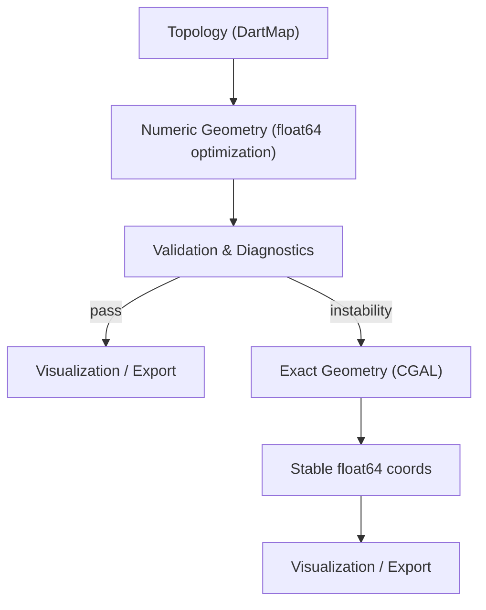

# PolyGraph Implementation Roadmap

## Context

PolyGraph is a research library for polyhedral topology built on combinatorial maps. The following layers are implemented:

- **Structures** ✅ — `permutation`, `dart_map`, `traversal` (~1060 lines)
- **Generators** ✅ — `platonic`, `prisms`, `johnson` (pyramid/dipyramid families + three convex-deltahedra with hardcoded generators: J84, J51, J17); `archimedean` and `catalan` are stubs deferred to Phase 10
- **Symmetry algorithms** ✅ — `algorithms/symmetry/automorphisms`, `algorithms/symmetry/orbits`, `algorithms/symmetry/point_groups`, `algorithms/symmetry/classify`, `interop/pynauty_adapter`

Everything else — planar algorithms, triangulation, geometry, visualization, export, remaining interop adapters — exists as empty stubs. This plan sequences the implementation of all remaining layers, respecting dependency order and minimizing mathematical machinery at each stage.

**Guiding principles for a research package:**
- Implement the simplest correct version first; optimize later
- Prefer explicit loops over clever abstractions — readability matters more than DRY
- Each phase should produce testable, usable artifacts (not just plumbing)
- Numpy for array math; avoid custom linear algebra wrappers

### Geometry Pipeline

The system is designed to separate topology from geometry and to treat
floating-point as the working representation. In later phases (see Phase 13),
an exact geometry backend (CGAL) is planned as an escape hatch when numeric
methods become unreliable:



The pipeline is intended to stay fast by remaining numeric most of the time.
Exact arithmetic will be invoked only when validation detects degeneracies,
constraint violations, or numerical instability. The minimal CGAL integration
planned for Phase 13 consists of: the exact kernel (EPECK), `Plane_3`, a
mesh structure (`Surface_mesh` or `Polyhedron_3`), and optionally convex hull
/ halfspace intersection algorithms. This combination will verify planes,
reconstruct exact vertices when numeric methods fail, and convert the result
back to float64 for rendering.

---

## Phase 1: Generators — Platonic Solids & Parametric Families

**Why first:** Every subsequent layer needs concrete DartMaps to test against. Currently the only test fixture is a hand-built tetrahedron in test_traversal.py.

### 1a. `generators/prisms.py` ✅ Complete
| Function | V | E | F | Notes |
|---|---|---|---|---|
| `prism(n)` | 2n | 3n | n+2 | Two n-gon caps + n quads; n≥3 |
| `antiprism(n)` | 2n | 4n | 2n+2 | Two n-gon caps + 2n triangles; n≥3 |

**Math:** Parametric face generation from cyclic index arithmetic (mod n). The formulas above apply for n≥3.

### 1b. `generators/platonic.py` ✅ Complete
Each function returns `DartMap.from_face_lists(faces, num_vertices)`.

| Function | V | E | F | Face sizes | Math needed |
|---|---|---|---|---|---|
| `tetrahedron()` | 4 | 6 | 4 | all 3 | 4 triangular faces |
| `cube()` | 8 | 12 | 6 | all 4 | Delegate to `prism(4)` |
| `octahedron()` | 6 | 12 | 8 | all 3 | Delegate to `antiprism(3)` |
| `dodecahedron()` | 20 | 30 | 12 | all 5 | 12 pentagonal faces (use known vertex adjacency) |
| `icosahedron()` | 12 | 30 | 20 | all 3 | 20 triangular faces |

**Minimum math:** Just hardcoded oriented face lists. Verify via Euler characteristic (V - E + F = 2) and genus (0).

### 1c. `generators/johnson.py` (subset) ✅ Complete

Within Phase 1, only implement the two simplest parametric families. All 92 will be added in
later phases as the face-winding machinery matures. Pyramid(4) and Pyramid(5) are Johnson solids.
Dipyramid(3) and Dipyramid(4) are Johnson solids. Dipyramid(4) is the octahedron, which is Platonic as already noted.

| Function | Notes |
|---|---|
| `pyramid(n)` | n-gon base + n triangles, V=n+1 |
| `dipyramid(n)` | 2n triangles, V=n+2 |

Defer `cupola(n)` and `rotunda()` — they need more complex face winding.

#### All 92 Johnson Solids — Properties Reference

Johnson (1966) proved these are the only 92 strictly-convex polyhedra with
regular-polygon faces that are neither Platonic, Archimedean, prism, nor
antiprism. Symmetry notation is Schönflies (Cnv, Dnh, Dnd, Cs, etc.).
V–E+F = 2 for all. Rows marked `*` have J-numbers that should be verified
against the Wikipedia/Johnson (1966) reference.

**Pyramids** (J1–J2)

| J# | Name | Sym | V | E | F |
|---|---|---|---|---|---|
| J1 | Square pyramid | C4v | 5 | 8 | 5 |
| J2 | Pentagonal pyramid | C5v | 6 | 10 | 6 |

**Cupolas and Rotunda** (J3–J6)

| J# | Name | Sym | V | E | F |
|---|---|---|---|---|---|
| J3 | Triangular cupola | C3v | 9 | 15 | 8 |
| J4 | Square cupola | C4v | 12 | 20 | 10 |
| J5 | Pentagonal cupola | C5v | 15 | 25 | 12 |
| J6 | Pentagonal rotunda | C5v | 20 | 35 | 17 |

**Elongated Pyramids** (J7–J9)

| J# | Name | Sym | V | E | F |
|---|---|---|---|---|---|
| J7 | Elongated triangular pyramid | C3v | 7 | 12 | 7 |
| J8 | Elongated square pyramid | C4v | 9 | 16 | 9 |
| J9 | Elongated pentagonal pyramid | C5v | 11 | 20 | 11 |

**Gyroelongated Pyramids** (J10–J11)

| J# | Name | Sym | V | E | F |
|---|---|---|---|---|---|
| J10 | Gyroelongated square pyramid | C4v | 9 | 20 | 13 |
| J11 | Gyroelongated pentagonal pyramid | C5v | 11 | 25 | 16 |

**Dipyramids** (J12–J13)

| J# | Name | Sym | V | E | F |
|---|---|---|---|---|---|
| J12 | Triangular dipyramid | D3h | 5 | 9 | 6 |
| J13 | Pentagonal dipyramid | D5h | 7 | 15 | 10 |

Note: The square dipyramid is the octahedron (Platonic), hence excluded.

**Elongated Dipyramids** (J14–J16)

| J# | Name | Sym | V | E | F |
|---|---|---|---|---|---|
| J14 | Elongated triangular dipyramid | D3h | 8 | 15 | 9 |
| J15 | Elongated square dipyramid | D4h | 10 | 20 | 12 |
| J16 | Elongated pentagonal dipyramid | D5h | 12 | 25 | 15 |

**Augmented Prisms** (J17–J25)

Square pyramids are augmented onto square faces of prisms.

| J# | Name | Sym | V | E | F |
|---|---|---|---|---|---|
| J17 | Augmented triangular prism | C2v | 7 | 13 | 8 |
| J18 | Biaugmented triangular prism | C2v | 8 | 17 | 11 |
| J19 | Triaugmented triangular prism | D3h | 9 | 21 | 14 |
| J20 | Augmented pentagonal prism | C2v | 11 | 19 | 10 |
| J21 | Biaugmented pentagonal prism | C2 | 12 | 23 | 13 |
| J22 | Augmented hexagonal prism | C2v | 13 | 22 | 11 |
| J23 | Parabiaugmented hexagonal prism | D2h | 14 | 26 | 14 |
| J24 | Metabiaugmented hexagonal prism | C2v | 14 | 26 | 14 |
| J25 | Triaugmented hexagonal prism | D3h | 15 | 30 | 17 |

**Augmented Dodecahedra** (J26–J29)

Pentagonal pyramids are augmented onto pentagonal faces of the dodecahedron.

| J# | Name | Sym | V | E | F |
|---|---|---|---|---|---|
| J26 | Augmented dodecahedron | C5v | 21 | 35 | 16 |
| J27 | Parabiaugmented dodecahedron | D5d | 22 | 40 | 20 |
| J28 | Metabiaugmented dodecahedron | C2v | 22 | 40 | 20 |
| J29 | Triaugmented dodecahedron | C3v | 23 | 45 | 24 |

**Diminished and Augmented Icosahedra** (J30–J32)

| J# | Name | Sym | V | E | F |
|---|---|---|---|---|---|
| J30 | Metabidiminished icosahedron | C2v | 10 | 20 | 12 |
| J31 | Tridiminished icosahedron | C3v | 9 | 15 | 8 |
| J32 | Augmented tridiminished icosahedron | C3v | 10 | 18 | 10 |

**Augmented Truncated Archimedean Solids** (J33–J40)

Cupolas are augmented onto polygonal faces of truncated Platonic solids.

| J# | Name | Alt. name | Sym | V | E | F |
|---|---|---|---|---|---|---|
| J33 | Augmented truncated tetrahedron | — | C3v | 15 | 27 | 14 |
| J34 | Biaugmented truncated tetrahedron | — | C3v | 18 | 36 | 20 |
| J35 | Augmented truncated cube | — | C4v | 28 | 48 | 22 |
| J36 | Biaugmented truncated cube | — | D4h | 32 | 60 | 30 |
| J37 | Augmented truncated dodecahedron | — | C5v | 65 | 105 | 42 |
| J38 | Parabiaugmented truncated dodecahedron | — | D5d | 70 | 120 | 52 |
| J39 | Metabiaugmented truncated dodecahedron | — | C2v | 70 | 120 | 52 |
| J40 | Triaugmented truncated dodecahedron | — | C3v | 75 | 135 | 62 |

**Gyrate and Diminished Rhombicosidodecahedra** (J41–J49)

Gyration rotates a pentagonal cupola cap by 36°; diminution removes one.

| J# | Name | Sym | V | E | F |
|---|---|---|---|---|---|
| J41 | Gyrate rhombicosidodecahedron | C5v | 60 | 120 | 62 |
| J42 | Parabigyrate rhombicosidodecahedron | D5d | 60 | 120 | 62 |
| J43 | Metabigyrate rhombicosidodecahedron | C2v | 60 | 120 | 62 |
| J44 | Trigyrate rhombicosidodecahedron | C3v | 60 | 120 | 62 |
| J45 | Diminished rhombicosidodecahedron | C5v | 55 | 105 | 52 |
| J46 | Parabigyrate diminished rhombicosidodecahedron | C2v | 55 | 105 | 52 |
| J47 | Metabigyrate diminished rhombicosidodecahedron | Cs | 55 | 105 | 52 |
| J48 | Gyrate bidiminished rhombicosidodecahedron | C2v | 50 | 90 | 42 |
| J49 | Tridiminished rhombicosidodecahedron | C3v | 45 | 75 | 32 |

**Elongated Cupola and Rotunda** (J50–J53)

Cupola/rotunda with a prism inserted at the polygonal base.

| J# | Name | Sym | V | E | F |
|---|---|---|---|---|---|
| J50 | Elongated triangular cupola | C3v | 15 | 27 | 14 |
| J51 | Elongated square cupola | C4v | 20 | 36 | 18 |
| J52 | Elongated pentagonal cupola | C5v | 25 | 45 | 22 |
| J53 | Elongated pentagonal rotunda | C5v | 30 | 55 | 27 |

**Gyroelongated Cupola and Rotunda** (J54–J57)

Cupola/rotunda with an antiprism inserted at the polygonal base.
The antiprism's alternating triangles remove vertical mirror planes,
reducing symmetry from Cnv to Cn for the n=5 cases (J56, J57).

| J# | Name | Sym | V | E | F |
|---|---|---|---|---|---|
| J54 | Gyroelongated triangular cupola | C3v | 15 | 33 | 20 |
| J55 | Gyroelongated square cupola | C4v | 20 | 44 | 26 |
| J56 | Gyroelongated pentagonal cupola | C5 | 25 | 55 | 32 |
| J57 | Gyroelongated pentagonal rotunda | C5 | 30 | 65 | 37 |

**Bicupola and Cupola-Rotunda** (J58–J64)

Two cupolas joined at their 2n-gon bases.
Note: triangular orthobicupola = cuboctahedron (Archimedean, excluded);
square gyrobicupola = rhombicuboctahedron (Archimedean, excluded);
pentagonal gyrobirotunda = icosidodecahedron (Archimedean, excluded).

| J# | Name | Sym | V | E | F |
|---|---|---|---|---|---|
| J58 | Triangular gyrobicupola | D3 | 12 | 24 | 14 |
| J59 | Square orthobicupola | D4h | 16 | 32 | 18 |
| J60 | Square gyrobicupola | D4d | 16 | 32 | 18 |
| J61 | Pentagonal orthobicupola | D5h | 20 | 40 | 22 |
| J62 | Pentagonal gyrobicupola | D5d | 20 | 40 | 22 |
| J63 | Pentagonal orthocupolarotunda | C5v | 25 | 50 | 27 |
| J64 | Pentagonal gyrocupolarotunda | C5 | 25 | 50 | 27 |

**Elongated Bicupola and Cupola-Rotunda** (J65–J71)

Bicupola with a prism inserted between the two cupolas.
Note: elongated square orthobicupola = rhombicuboctahedron (Archimedean, excluded).

| J# | Name | Alt. name | Sym | V | E | F |
|---|---|---|---|---|---|---|
| J65 | Elongated triangular orthobicupola | — | D3h | 18 | 36 | 20 |
| J66 | Elongated triangular gyrobicupola | — | D3d | 18 | 36 | 20 |
| J67 | Elongated square gyrobicupola | Pseudorhombicuboctahedron | D4d | 24 | 48 | 26 |
| J68 | Elongated pentagonal orthobicupola | — | D5h | 30 | 60 | 32 |
| J69 | Elongated pentagonal gyrobicupola | — | D5d | 30 | 60 | 32 |
| J70 | Elongated pentagonal orthocupolarotunda | — | C5v | 35 | 70 | 37 |
| J71 | Elongated pentagonal gyrocupolarotunda | — | C5 | 35 | 70 | 37 |

**Gyroelongated Bicupola and Related** (J72–J83)

Bicupola with an antiprism inserted between the two cupolas.

| J# | Name | Sym | V | E | F |
|---|---|---|---|---|---|
| J72 | Gyroelongated triangular orthobicupola | D3 | 18 | 42 | 26 |
| J73 | Gyroelongated triangular gyrobicupola | D3d | 18 | 42 | 26 |
| J74 | Gyroelongated square orthobicupola | D4 | 24 | 56 | 34 |
| J75 | Gyroelongated square gyrobicupola | D4d | 24 | 56 | 34 |
| J76* | Gyroelongated pentagonal orthobicupola | D5 | 30 | 70 | 42 |
| J77* | Gyroelongated pentagonal gyrobicupola | D5d | 30 | 70 | 42 |
| J78* | Gyroelongated pentagonal orthocupolarotunda | C5 | 35 | 80 | 47 |
| J79* | Gyroelongated pentagonal gyrocupolarotunda | C5 | 35 | 80 | 47 |
| J80* | Elongated pentagonal orthobirotunda | C5v | 40 | 80 | 42 |
| J81* | Elongated pentagonal gyrobirotunda | D5d | 40 | 80 | 42 |
| J82* | Gyroelongated pentagonal orthobirotunda | D5 | 40 | 90 | 52 |
| J83* | Gyroelongated pentagonal gyrobirotunda | D5d | 40 | 90 | 52 |

`*` J76–J83 exact numbering should be verified against the Wikipedia reference
(the ordering within this sub-family varies by source).
**Snub Antiprisms** (J84–J85)

| J# | Name | Sym | V | E | F |
|---|---|---|---|---|---|
| J84 | Snub disphenoid | D2d | 8 | 18 | 12 |
| J85 | Snub square antiprism | D4d | 16 | 40 | 26 |

**Miscellaneous** (J86–J92)

These seven solids do not belong to any parametric family.

| J# | Name | Sym | V | E | F |
|---|---|---|---|---|---|
| J86 | Sphenocorona | C2v | 10 | 22 | 14 |
| J87 | Augmented sphenocorona | Cs | 11 | 26 | 17 |
| J88 | Sphenomegacorona | C2v | 12 | 28 | 18 |
| J89 | Hebesphenomegacorona | C2v | 14 | 33 | 21 |
| J90 | Disphenocingulum | D2d | 16 | 38 | 24 |
| J91 | Bilunabirotunda | D2h | 26 | 49 | 25 |
| J92 | Triangular hebesphenorotunda | C3v | 21 | 33 | 14 |

### 1d. Convex Deltahedra — Coverage Confirmed ✅

All 8 convex deltahedra (polyhedra whose faces are all equilateral triangles) are covered by
existing generators:

- **3 Platonic:** tetrahedron, octahedron, icosahedron (`platonic.py`)
- **2 via `bipyramid(n)`:** triangular bipyramid (J12, n=3), pentagonal bipyramid (J13, n=5)
- **3 remaining Johnson deltahedra** — implemented as hardcoded face lists
  in `johnson.py`:

| Function | Johnson # | V | E | F |
|---|---|---|---|---|
| `snub_disphenoid()` | J84 | 8 | 18 | 12 |
| `triaugmented_triangular_prism()` | J51 | 9 | 21 | 14 |
| `gyroelongated_square_bipyramid()` | J17 | 10 | 24 | 16 |

### 1e. `generators/archimedean.py` (stub — defer)

The 13 Archimedean solids are vertex-transitive with regular polygon faces. Several arise
naturally from Conway operators on Platonic solids (`truncate`, `ambo`, `expand`, `snub` —
Phase 10), so defer hardcoded implementations until Phase 10 is complete. Add function stubs
with `raise NotImplementedError` now so call sites can be written.

| Function | Vertex config | V | E | F |
|---|---|---|---|---|
| `truncated_tetrahedron()` | 3.6.6 | 12 | 18 | 8 |
| `cuboctahedron()` | 3.4.3.4 | 12 | 24 | 14 |
| `truncated_cube()` | 3.8.8 | 24 | 36 | 14 |
| `truncated_octahedron()` | 4.6.6 | 24 | 36 | 14 |
| `rhombicuboctahedron()` | 3.4.4.4 | 24 | 48 | 26 |
| `truncated_cuboctahedron()` | 4.6.8 | 48 | 72 | 26 |
| `snub_cube()` | 3.3.3.3.4 | 24 | 60 | 38 |
| `icosidodecahedron()` | 3.5.3.5 | 30 | 60 | 32 |
| `truncated_dodecahedron()` | 3.10.10 | 60 | 90 | 32 |
| `truncated_icosahedron()` | 5.6.6 | 60 | 90 | 32 |
| `rhombicosidodecahedron()` | 3.4.5.4 | 60 | 120 | 62 |
| `truncated_icosidodecahedron()` | 4.6.10 | 120 | 180 | 62 |
| `snub_dodecahedron()` | 3.3.3.3.5 | 60 | 150 | 92 |

### 1f. `generators/catalan.py` (stub — defer)

The 13 Catalan solids are the duals of the Archimedean solids. Defer until Phase 2 dual
construction (`dual_of`) and Phase 10 Conway operators are complete; most can be derived via
`dual_of(archimedean_solid())`. Add function stubs with `raise NotImplementedError` now.

| Function | Dual of | Face type |
|---|---|---|
| `triakis_tetrahedron()` | truncated tetrahedron | isosceles triangle |
| `rhombic_dodecahedron()` | cuboctahedron | rhombus |
| `triakis_octahedron()` | truncated cube | isosceles triangle |
| `tetrakis_hexahedron()` | truncated octahedron | isosceles triangle |
| `deltoidal_icositetrahedron()` | rhombicuboctahedron | kite |
| `disdyakis_dodecahedron()` | truncated cuboctahedron | scalene triangle |
| `pentagonal_icositetrahedron()` | snub cube | irregular pentagon |
| `rhombic_triacontahedron()` | icosidodecahedron | rhombus |
| `triakis_icosahedron()` | truncated dodecahedron | isosceles triangle |
| `pentakis_dodecahedron()` | truncated icosahedron | isosceles triangle |
| `deltoidal_hexacontahedron()` | rhombicosidodecahedron | kite |
| `disdyakis_triacontahedron()` | truncated icosidodecahedron | scalene triangle |
| `pentagonal_hexacontahedron()` | snub dodecahedron | irregular pentagon |

**Implementation priority within Phase 1c:** `pyramid(n)` and `bipyramid(n)`
first (simplest), then `cupola(n)` (Phase 2+), then the full catalogue.

### Testing
- Euler characteristic = 2 for every generated solid
- Genus = 0
- Expected V, E, F counts
- Alpha is involution, sigma covers all darts
- Round-trip: `face_orbits()` recovers input faces (up to cyclic rotation)

### Files
- `src/polygraph/generators/prisms.py`
- `src/polygraph/generators/platonic.py`
- `src/polygraph/generators/johnson.py`
- `src/polygraph/generators/archimedean.py` (stubs only)
- `src/polygraph/generators/catalan.py` (stubs only)
- `tests/generators/test_platonic.py`
- `tests/generators/test_prisms.py`

### 1g. `generators/notation.py` — Schläfli & vertex-configuration symbols

**Minimum foundation:** Only the already-complete traversal layer is needed — no geometry, no symmetry.

**Schläfli symbol `{p, q}`** is defined only for *regular* polyhedra where every face is a p-gon and every vertex has degree q. Both values are read directly from the dart map:

```python
def schlafli_symbol(dm: DartMap) -> tuple[int, int]:
    """Return (p, q) for a regular polyhedron, or raise ValueError if not regular."""
    face_sizes = {len(list(face_darts(dm, f))) for f in all_face_orbits(dm)}
    vertex_degrees = {len(list(vertex_darts(dm, v))) for v in all_vertex_orbits(dm)}
    if len(face_sizes) != 1 or len(vertex_degrees) != 1:
        raise ValueError("Not a regular polyhedron")
    return face_sizes.pop(), vertex_degrees.pop()
```

| Solid | {p, q} |
|---|---|
| Tetrahedron | {3, 3} |
| Cube | {4, 3} |
| Octahedron | {3, 4} |
| Dodecahedron | {5, 3} |
| Icosahedron | {3, 5} |

**Vertex-configuration string** generalizes to *semi-regular* (Archimedean) polyhedra and prisms, where different face sizes can appear around each vertex. For a given vertex v, walk around its face orbits in sigma-order and record face sizes:

```python
def vertex_configuration(dm: DartMap) -> str:
    """Return the vertex-configuration string, e.g. '3.4.3.4' for cuboctahedron.
    Raises ValueError if the configuration differs between vertices.
    """
```

- For a prism(n): `4.4.n`
- For an antiprism(n): `3.3.3.n`
- Archimedean solids have uniform vertex configurations (same for every vertex)

**Files:**
- `src/polygraph/generators/notation.py`
- tests added to `tests/generators/test_platonic.py` and `tests/generators/test_prisms.py`
---

## Phase 2: Symmetry Detection ✅

**Why now:** Symmetry detection depends only on the DartMap structure and the generators from Phase 1. Establishing the automorphism pipeline early enables symmetry-constrained optimization in later phases (geometry, layout refinement) and provides a clean validation target using well-understood Platonic solid symmetry groups.

### 2a. `interop/pynauty_adapter.py` ✅

nauty (via `pynauty`) computes automorphism generators using canonical labeling — faster and more correct than brute-forcing, especially for larger polyhedra.

**Encoding:** Build an undirected, vertex-colored graph with `5n/2` vertices in three color classes:
- **Dart vertices** `0..n-1` (color 0) — one per dart.
- **Phi-arc gadgets** `n..2n-1` (color 1) — gadget `n+d` sits between dart `d` and `phi(d)`, encoding the directed face-traversal step.
- **Alpha-arc gadgets** `2n..2n+n//2-1` (color 2) — one per undirected edge, connecting the two darts of that edge.

Using **phi-arcs** rather than sigma-arcs is the key design choice: phi-cycles correspond to faces, so gadgets respect face sizes. An automorphism can only map a face of size `k` to another face of size `k`, preventing spurious cross-face-size symmetries that sigma-arc gadgets would admit.

Any automorphism of this colored graph that permutes dart vertices satisfies `pi ∘ alpha = alpha ∘ pi` (from the alpha gadgets) and either `pi ∘ phi = phi ∘ pi` (orientation-preserving) or `pi ∘ phi = phi⁻¹ ∘ pi` (orientation-reversing) — exactly the full polyhedral automorphism group including reflections.

`pynauty.autgrp()` returns raw generators (as permutations on all `5n/2` vertices); the adapter truncates each to the first `n` entries to recover permutations on darts.

### 2b. `algorithms/symmetry/automorphisms.py`
- `compute_automorphism_generators(dm) -> list[Permutation]`: Return generating set for Aut(dm)
- `automorphism_group_order(generators, num_darts) -> int`: Compute |Aut(dm)| via Schreier-Sims or orbit-counting
- `is_orientation_preserving(pi, dm) -> bool`: Check if automorphism preserves face orientation

### 2c. `algorithms/symmetry/orbits.py`
- `compute_orbits(generators, n) -> list[list[int]]`: General orbit computation under a permutation group
- `dart_orbits(generators, dm)`, `vertex_orbits(generators, dm)`, `edge_orbits(generators, dm)`, `face_orbits(generators, dm)`: Derived orbit partitions

**Math:** Union-find on elements under generator action. For each generator g and element x, union x with g(x).

### Testing
- Tetrahedron: |Aut| = 24, 1 vertex orbit, 1 edge orbit, 1 face orbit
- Cube: |Aut| = 48, 1 vertex orbit, 1 edge orbit, 1 face orbit
- Icosahedron: |Aut| = 120, 1 vertex orbit, 1 edge orbit, 1 face orbit
- Prism(5): |Aut| = 20, 2 vertex orbits, 2 edge orbits, 2 face orbits

### Files
- `src/polygraph/interop/pynauty_adapter.py`
- `src/polygraph/algorithms/symmetry/automorphisms.py`
- `src/polygraph/algorithms/symmetry/orbits.py`
- `tests/algorithms/test_symmetry.py`

---

## Phase 3: Symmetry Classification & Point Groups ✅ Complete

### 3a. `algorithms/symmetry/point_groups.py`
- Define point group templates as named tuples: `(name, order, generators_pattern)`
- Families: C_n, D_n, T, O, I (and their variants with reflections)
- `cyclic(n)`, `dihedral(n)`, `tetrahedral()`, `octahedral()`, `icosahedral()`

### 3b. `algorithms/symmetry/classify.py`
- `classify_symmetry(generators, dm) -> str`: Match computed automorphism group against known point group templates
- Uses group order + orbit structure to narrow candidates

**Math:** Group order alone is insufficient — orbit structure and face size distribution
are also required to uniquely identify the group. Full decision table:

| Group | Aut | nv | nf | Additional condition |
|-------|-----|----|----|----------------------|
| I_h   | 120 | 1  | 1  | flag-transitive      |
| I     | 60  | 1  | 1  | flag-transitive, chiral |
| O_h   | 48  | 1  | 1  | flag-transitive      |
| T_d   | 24  | 1  | 1  | has reflections      |
| O     | 24  | 1  | 1  | no reflections (chiral) |
| D_nh  | 4n  | 1  | 2  | lateral face size ≠ 3 (prism) |
| D_nd  | 4n  | 1  | 2  | lateral face size = 3 (antiprism) |
| D_nh  | 4n  | 2  | 1  | (dipyramid)          |
| C_nv  | 2n  | 2  | 2  | (pyramid)            |

*nv* = number of vertex orbits, *nf* = number of face orbits.

Note on orbit counts: prisms have **nv=1** because the horizontal mirror σ_h maps the
top vertex ring onto the bottom ring, making all 2n vertices equivalent. Dipyramids
have **nv=2** because the two apex vertices form one orbit and the n equatorial vertices
form another — there is no symmetry operation that maps an apex to an equatorial vertex.

### Files
- `src/polygraph/algorithms/symmetry/point_groups.py`
- `src/polygraph/algorithms/symmetry/classify.py`
- `tests/algorithms/test_symmetry_classify.py`

---

## Phase 4: Structure Completions — Dual & Validation

### 4a. `structures/dual.py`
Dual map construction: swap vertex and face roles.

```
dual_sigma = phi              (face walk becomes vertex rotation)
dual_alpha = alpha            (edge involution unchanged)
dual_phi   = phi⁻¹ ∘ alpha    (by definition: phi(d) = sigma⁻¹ ∘ alpha(d))
```

- `dual_of(dm) -> DartMap`: Construct dual by reinterpreting permutations
- The dart set is the same; only sigma/alpha roles change

**Math:** For a combinatorial map (sigma, alpha), the dual is (phi, alpha) where phi = sigma⁻¹ ∘ alpha. Since our DartMap stores sigma and alpha, the dual's sigma is the original phi, and the dual's alpha stays the same.

**Validation:** `dual_of(cube())` should have the topology of an octahedron (V=6, E=12, F=8). `dual_of(dual_of(dm))` should recover the original.

### 4b. `structures/validation.py`
Extract and expose the invariant checks already embedded in `DartMap.__post_init__`:

- `check_alpha_involution(alpha)` — alpha[alpha[d]] == d, no fixed points
- `check_sigma_permutation(sigma)` — valid permutation on 0..n-1
- `check_euler_characteristic(dm, expected)` — V - E + F == expected
- `is_3_connected(dm)` — needed later for planar drawing (Chrobak-Kant requires 3-connectivity). Implement via checking that removing any 2 vertices leaves the graph connected. For small polyhedra this is tractable with BFS.

### Files
- `src/polygraph/structures/dual.py`
- `src/polygraph/structures/validation.py`
- `tests/structures/test_dual.py`
- `tests/structures/test_validation.py`

---

## Phase 5: Triangulation

**Why now:** Chrobak-Kant convex grid drawing (Phase 8: Canonical Ordering & Convex Grid Drawing) requires a **triangulated** 3-connected planar graph. Most Platonic solids are not triangulated (cube has quad faces, dodecahedron has pentagonal faces).

**Placement note:** Phase 5 is intentionally ordered after Phases 2–3 (symmetry detection and classification). The choice of diagonals when splitting non-triangular faces should preserve as much of the original symmetry as possible, rather than breaking it arbitrarily. The exact mechanism for symmetry-preserving triangulation is still to be worked out. A candidate approach: for each orbit of n-gons (n > 3), examine the vertex orbits along the face boundary; if the boundary vertices fall into two or more distinct vertex orbits, prefer diagonals that connect representatives of distinct orbits. Uniform faces (all vertices in one orbit) may require a tie-breaking rule based on dart index or symmetry-group order.

### 5a. `algorithms/triangulation/augment.py`
- `triangulate(dm) -> TriangulationResult`: Fan-triangulate every non-triangular face by adding edges from one vertex to all non-adjacent vertices on the face boundary
- Track which edges are "dummy" (added by triangulation) by recording their **representative darts** (one dart per undirected edge, per the representative-dart convention), so they can be removed later — return a `TriangulationResult(dart_map, dummy_edges)` namedtuple, where `dummy_edges` is this collection of representative darts

**Math:** For a face with k vertices (k > 3), pick one vertex v and add edges to the k-3 non-adjacent vertices. This adds k-3 edges and splits the face into k-2 triangles. New darts need correct sigma/alpha wiring.

**Implementation approach:** Rebuild face lists with subdivided faces, then call `DartMap.from_face_lists()`. This is simpler than in-place dart surgery and leverages the existing validated constructor.

### 5b. `algorithms/triangulation/validation.py`
- `is_triangulated(dm) -> bool`: Check that every face orbit has exactly 3 darts

### Testing
- `triangulate(cube())` should have F=12 (6 quads → 12 triangles), all faces triangular
- `triangulate(tetrahedron())` should be a no-op (already triangulated)
- Euler characteristic preserved
- `is_triangulated()` returns True after triangulation

### Files
- `src/polygraph/algorithms/triangulation/augment.py`
- `src/polygraph/algorithms/triangulation/validation.py`
- `tests/algorithms/test_triangulation.py`

---

## Phase 6: NetworkX Interop

**Why now:** `networkx` is a required dependency of the `planar` extras. The
planar-embedding and layout phases that follow use NetworkX utilities (shortest
paths, planarity checks, graph analysis). Establishing the adapter here — before
any planar phase begins — lets those phases rely on NetworkX freely and allows
users to round-trip between `DartMap` and NetworkX graphs from the start of
planar work.

### 6a. `interop/networkx_adapter.py`
- `dart_map_to_nx(dm) -> nx.Graph`: Convert DartMap to an undirected NetworkX
  graph (vertices as nodes, one edge per edge orbit). Embedding information is
  not preserved, but adjacency is.
- `nx_to_dart_map(g) -> DartMap`: Convert an undirected planar NetworkX graph to
  a DartMap, using `nx.check_planarity` to derive face lists.

### Testing
- `dart_map_to_nx(cube())` has 8 nodes and 12 edges
- Round-trip: `nx_to_dart_map(dart_map_to_nx(dm))` recovers the same V, E, F
  counts for each Platonic solid

### Files
- `src/polygraph/interop/networkx_adapter.py`
- `tests/interop/test_networkx_adapter.py`

---

## Phase 7: Planar Embedding Infrastructure

### 7a. `algorithms/planar/embedding.py`
- `PlanarEmbeddingView(dm)`: Thin wrapper providing neighbor-order and face-boundary queries in terms the planar algorithms expect. Mostly delegates to traversal functions.
- `ordered_neighbors(v)` → vertices adjacent to v in cyclic (sigma) order
- `face_boundary_vertices(f)` → boundary vertices of face f
- `degree(v)` → number of darts at vertex v

### 7b. `algorithms/planar/outer_face.py`
- `choose_outer_face(dm) -> int`: Select the face to serve as the outer (unbounded) face for planar drawing. Heuristic: choose the face with the most boundary vertices.
- `outer_face_anchors(dm, outer_face) -> tuple[int, int, int]`: Pick three vertices on the outer face boundary to anchor the convex drawing (needed by canonical ordering).

### Testing
- Verify cyclic neighbor order matches sigma orbit order
- Outer face of cube should be a 4-cycle
- Anchors are distinct vertices on the outer face boundary

### Files
- `src/polygraph/algorithms/planar/embedding.py`
- `src/polygraph/algorithms/planar/outer_face.py`
- `tests/algorithms/test_planar_embedding.py`

---

## Phase 8: Canonical Ordering & Convex Grid Drawing

This is the core near-term research target from the README.

### 8a. `algorithms/planar/canonical_order.py`
Canonical ordering of a **triangulated** 3-connected planar graph (de Fraysseix, Pach, Pollack / Kant).

**Input:** Triangulated DartMap + outer face with 3 anchor vertices (v1, v2, vn)
**Output:** Vertex ordering [v1, v2, ..., vn] such that:
  - v1, v2 are on the outer face and adjacent
  - vn is on the outer face
  - For k ≥ 3, vk has ≥ 2 neighbors in {v1, ..., v_{k-1}} and they form a contiguous interval on the outer boundary of G_{k-1}

**Algorithm:** Process vertices in reverse order. Maintain the outer boundary. At each step remove a vertex whose neighbors on the current outer boundary form a contiguous interval of length ≥ 2.

**Math:** Graph theory — contiguous neighbor intervals on a boundary path. Implementation uses the DartMap's face/vertex traversal to identify boundary structure.

### 8b. `algorithms/planar/contour_state.py`
- Track the evolving outer contour during incremental vertex placement
- Doubly-linked list of boundary vertices with efficient insert/delete
- `ContourState`: init from base edge (v1, v2), then `add_vertex(vk, left, right)` to update boundary

### 8c. `algorithms/planar/shift_structure.py`
- Shift accumulator for Chrobak-Kant x-coordinate computation
- Each vertex gets a relative x-shift; final coordinates computed by prefix sum

### 8d. `geometry/planar/layout.py`
- `chrobak_kant_layout(dm, outer_face=None) -> dict[int, tuple[int, int]]`
  - Full pipeline: triangulate → canonical order → shift-based placement
  - Returns integer grid coordinates for each vertex
  - All faces convex, grid size at most (2n-4) × (n-2)

**Math:** The Chrobak-Kant algorithm:
1. Compute canonical ordering
2. Place v1 at (0, 0), v2 at (2(n-2), 0)
3. For each vk in order: place on lines of slope +1 and -1 from its leftmost and rightmost existing neighbors
4. Shift existing vertices to make room (shift structure)

### Testing
- All faces of the resulting drawing should be convex (cross-product test on consecutive edges)
- Coordinates are integers
- No edge crossings (for small cases, check all pairs)
- Works on triangulated tetrahedron, cube, octahedron, icosahedron

### Files
- `src/polygraph/algorithms/planar/canonical_order.py`
- `src/polygraph/algorithms/planar/contour_state.py`
- `src/polygraph/algorithms/planar/shift_structure.py`
- `src/polygraph/geometry/planar/layout.py`
- `tests/algorithms/test_canonical_order.py`
- `tests/geometry/test_planar_layout.py`

---

## Phase 9: Visualization (Planar)

### 9a. `visualization/matplotlib_planar.py`
- `draw_planar_graph(dm, positions, ax=None)`: Draw edges as line segments, vertices as points
- `draw_faces(dm, positions, ax=None, colors=None)`: Fill faces with color
- Optional: label vertices, highlight orbits

**Math:** None beyond coordinate indexing. Uses matplotlib patches/lines.

### 9b. `visualization/svg_planar.py`
- `render_svg(dm, positions) -> str`: Pure SVG string output (no matplotlib dependency)
- Edges as `<line>`, vertices as `<circle>`, faces as `<polygon>`

### 9c. `geometry/planar/kamada_kawai.py`
Arbitrary force-directed layout for use before any peeling step — needed as the "initial state" panel in the educational walkthrough.

- `kamada_kawai_layout(dm) -> dict[int, tuple[float, float]]`: Classic Kamada-Kawai spring-model layout
  - Build ideal distances from graph-theoretic shortest paths (BFS on the adjacency induced by the DartMap)
  - Minimize total spring energy `E = Σ_{i<j} k_{ij}(|p_i - p_j| - l_{ij})²` via iterative vertex-by-vertex gradient descent (the standard Kamada-Kawai update rule)
  - Return floating-point 2D positions suitable for display or as a `positions` dict for `draw_planar_graph`

**Math:** Spring constants `k_{ij} = K / d_{ij}²`; ideal lengths `l_{ij} = L · d_{ij}` where `d_{ij}` is the shortest-path distance, `K` and `L` are global scale parameters. Convergence criterion: `max_i ‖∇_{p_i} E‖² < ε`, where `‖·‖` denotes the Euclidean norm on ℝ².

**Note:** This layout does not guarantee planarity or convexity — it is purely for visual clarity as an initial or "arbitrary" rendering before the canonical-ordering pipeline is applied.

### 9d. `visualization/walkthrough.py` — Educational Split-Screen Walkthrough
Step-by-step animated/interactive visualization of the canonical ordering algorithm:

**Left panel — initial graph (Kamada-Kawai):** Show the input planar graph in an arbitrary readable layout, with the outer face and anchor vertices (v1, v2, vn) highlighted.

**Right panel — canonical ordering buildup:** Replay the algorithm one step at a time:
1. Start from the triangulated graph; highlight the current outer contour.
2. Each frame removes the next vertex in peeling order from the right panel's view, coloring it to show its contiguous neighbor interval on the boundary.
3. After all vertices are peeled, replay in reverse as the Chrobak-Kant layout places them one by one, updating integer grid coordinates in real time.

**API:**
- `build_walkthrough_frames(dm) -> list[WalkthroughFrame]`: Compute all frames (positions + highlights) without rendering.
- `WalkthroughFrame`: dataclass holding `step_index`, `description`, `positions_left`, `positions_right`, `highlighted_vertex`, `contour_darts`.
- `render_walkthrough_matplotlib(frames, output_path=None)`: Render as a multi-panel matplotlib figure (one subplot per panel) or save an animated GIF/MP4 via `matplotlib.animation`.
- `render_walkthrough_svg_sequence(frames, output_dir)`: Emit one SVG file per frame for embedding in documentation or a web slideshow.

**Math:** No additional math beyond the layout algorithms already implemented in Phases 8 and 9c — this phase only composes the canonical ordering (8a), Chrobak-Kant layout (8d), and Kamada-Kawai layout (9c) into a single narrated sequence.

### Testing
- Smoke test: generates valid SVG/matplotlib figure without error
- Visual spot-check on cube, dodecahedron
- `build_walkthrough_frames(cube())` produces exactly `n - 1` frames in total (where `n` is the total number of vertices): `n - 3` peeling/placement frames (one per interior vertex added in canonical order), plus 1 initial anchor-selection frame (highlighting vertices `v1`, `v2`, `vn`) and 1 final layout frame
- Each frame's `positions_right` has integer coordinates after the placement phase

### Files
- `src/polygraph/visualization/matplotlib_planar.py`
- `src/polygraph/visualization/svg_planar.py`
- `src/polygraph/geometry/planar/kamada_kawai.py`
- `src/polygraph/visualization/walkthrough.py`
- `tests/visualization/test_planar_viz.py`
- `tests/visualization/test_walkthrough.py`

---

## Phase 10: Conway Operators

### 10a. `generators/conway.py`
Each operator takes a DartMap and produces a new DartMap.

Operators marked ★ are **primitive**: they are implemented directly and have
their own combinatorial recipe, even if an algebraic decomposition exists.
The rest are **algebraic** — they are defined purely as compositions of other
operators and are provided as convenience wrappers.

#### Primitive operators

All formulas are for genus-0 maps; V′−E′+F′=2 holds throughout.

| Operator | Conway | Effect | New V′, E′, F′ |
|---|---|---|---|
| `dual(dm)` ★ | `d` | Swap vertices/faces | F, E, V |
| `ambo(dm)` ★ | `a` | Edge midpoints become vertices | E, 2E, V+F |
| `kis(dm)` ★ | `k` | Add apex to each face (kleetope) | V+F, 3E, 2E |
| `truncate(dm)` ★ | `t` | Cut each vertex into a small face | 2E, 3E, V+F |
| `expand(dm)` ★ | `e` | Separate faces; fill gaps with quads | 2E, 4E, V+E+F |
| `snub(dm)` ★ | `s` | Chiral twist; fill gaps with triangles | 2E, 5E, 2+3E |
| `zip(dm)` ★ | `z` | Dual of kis; each edge → two quads | 2E, 3E, V+F |
| `chamfer(dm)` ★ | `c` | Replace each edge with a hexagonal band | V+2E, 4E, F+E |
| `whirl(dm)` ★ | `w` | Chiral chamfer with a rotational twist | V+4E, 7E, F+2E |

**Implementation:** Build new face lists from the old DartMap's combinatorial
structure, then call `from_face_lists()`. The dual can delegate to
`structures/dual.py`.  For `snub` and `whirl` (chiral), the recipe must choose
a consistent orientation (left- or right-hand twist) and the two chiralities
are enantiomorphs.

**Math:** Each operator is defined by a recipe that maps old
darts/vertices/edges/faces to new face lists. The key insight is that all
information is available from traversal — no geometry needed.

#### 10b. Named composites (`generators/conway.py` continued)

These are algebraic: each is a composition of primitive operators.  Provide
them as thin Python wrappers so callers can use idiomatic names without having
to chain calls by hand.

| Function | Definition | Conway | Effect |
|---|---|---|---|
| `join(dm)` | `dual(ambo(dm))` | `j = da` | Edges become quads; one quad per original edge |
| `needle(dm)` | `dual(truncate(dm))` | `n = dt` | Dual of truncate; each face triangulated from centre |
| `ortho(dm)` | `join(ambo(dm))` | `o = daa` | Each face subdivided into quads; all-quad result |
| `meta(dm)` | `kis(join(dm))` | `m = kda` | Each face divided into triangles via edge-midpoints and face-centres |
| `bevel(dm)` | `truncate(ambo(dm))` | `b = ta` | Each edge becomes a hexagonal face band |

> **Note on `zip`:** `zip` is listed as primitive (★) above. Although it has the
> algebraic identity `z = d(k)`, we still treat `zip` as a primitive operation and
> implement it via a direct combinatorial recipe (subdivide edges + recombine darts),
> using the identity only as a mathematical cross-check.

**Non-algebraic summary:** `dual`, `ambo`, `kis`, `truncate`, `expand`, `snub`,
`chamfer`, `whirl`, `zip` are primitive (★).  `join`, `needle`, `ortho`, `meta`,
`bevel` are algebraic.

### Files
- `src/polygraph/generators/conway.py`
- `tests/generators/test_conway.py`

---

## Phase 11: Polyhedral Realization (Numeric, float64)

This phase produces a numeric geometric realization using optimization and
floating-point arithmetic. The output is a candidate realization that must
pass through validation (Phase 12) before it is considered trustworthy.

### 11a. `geometry/polyhedral/face_planes.py`
- `FacePlaneParams`: Parameterize each face by a normal direction (2 spherical angles) + offset
- `expand_face_planes(params) -> tuple[ndarray, ndarray]`: Convert to (normals, offsets)
- `normal_from_spherical(phi, psi) -> ndarray`: Unit normal from angles

### 11b. `geometry/polyhedral/vertex_recovery.py`
- `recover_vertices(normals, offsets, dm) -> ndarray`: For each vertex, find the intersection of its incident face planes (least-squares solve of 3+ plane equations)

**Math:** Each vertex is the intersection of ≥ 3 planes. Solve n_i · x = d_i as a linear system. For exactly 3 planes: direct 3×3 solve. For >3: least-squares via `numpy.linalg.lstsq`.

### 11c. `geometry/polyhedral/initialization.py`
- Initialize face plane parameters from known geometry (e.g., Platonic solid coordinates)
- Or: random initialization with constraints (all normals pointing outward)

### 11d. `geometry/polyhedral/optimizer.py`
- `realize(dm, symmetry=None) -> RealizationResult`: Find 3D vertex positions satisfying:
  - Faces are planar
  - Edges have roughly uniform length (edge_uniformity_energy)
  - Dihedral angles are positive / faces don't intersect (dihedral_margin_energy)
  - Optional: symmetry constraints (reduce parameter space)
- Uses `scipy.optimize.minimize` with gradient-free or L-BFGS
- Returns `RealizationResult(vertices, face_planes, residuals)` — not yet validated

**Math:** Energy minimization. Parameters: face plane angles + offsets. Objective: sum of edge-length variance + dihedral penalty. Vertex positions are derived quantities (from vertex_recovery).

### Files
- `src/polygraph/geometry/polyhedral/face_planes.py`
- `src/polygraph/geometry/polyhedral/vertex_recovery.py`
- `src/polygraph/geometry/polyhedral/initialization.py`
- `src/polygraph/geometry/polyhedral/optimizer.py`
- `tests/geometry/test_polyhedral.py`

---

## Phase 12: Geometric Validation & Diagnostics

The validation layer sits between numeric realization and visualization.
It decides whether a numeric result is trustworthy or needs exact geometry
escalation. All checks use pure numpy — no CGAL dependency.

### 12a. `geometry/validation/diagnostics.py`
Per-element diagnostic checks on a `RealizationResult`:

- `face_planarity_residuals(vertices, dm) -> ndarray`: For each face, fit a plane to its vertices and return max deviation. Faces with k > 3 vertices can fail to be planar under float64 optimization.
- `edge_length_variance(vertices, dm) -> float`: Coefficient of variation of edge lengths — flags degenerate near-zero-length edges.
- `dihedral_angles(vertices, normals, dm) -> ndarray`: Dihedral angle at each edge. Negative or near-zero angles indicate face-face intersection or near-degeneracy.
- `vertex_degeneracy(vertices, dm) -> ndarray`: For each vertex, condition number of the plane intersection system. High condition number → vertex position is numerically unstable.

### 12b. `geometry/validation/stability.py`
Aggregate stability assessment:

- `ValidationReport`: Dataclass collecting all diagnostics with pass/fail per check.
- `validate_realization(result, dm, tolerances=None) -> ValidationReport`:
  Runs all diagnostics and classifies the result:
  - `STABLE` — all checks pass within tolerances, proceed to rendering
  - `MARGINAL` — some metrics near threshold, flag for user review
  - `UNSTABLE` — one or more checks fail, recommend exact geometry escalation
- `default_tolerances() -> dict`: Sensible defaults (e.g., planarity residual < 1e-10, condition number < 1e8, min dihedral angle > 1e-6 rad)

**Math:** Condition number of the 3×k plane-intersection system at each vertex (from `numpy.linalg.cond`). Planarity residual is the max distance from a vertex to the best-fit plane through its face's vertices. These are standard numerical stability metrics — no new theory needed.

**Design note:** Tolerances are configurable because research use cases may want to experiment with different thresholds. The defaults should be conservative enough to catch genuine problems without false-flagging well-conditioned results.

### Testing
- Known-good Platonic solids (from exact coordinates) should validate as STABLE
- Deliberately perturbed inputs (e.g., near-degenerate dihedral angles) should validate as UNSTABLE
- Condition number check should flag nearly-coplanar face triples at a vertex

### Files
- `src/polygraph/geometry/validation/__init__.py`
- `src/polygraph/geometry/validation/diagnostics.py`
- `src/polygraph/geometry/validation/stability.py`
- `tests/geometry/test_validation.py`

---

## Phase 13: Exact Geometry Fallback (CGAL)

When validation (Phase 12) reports `UNSTABLE`, this layer provides an exact
arithmetic reconstruction using CGAL. The pipeline escalates to exact
computation, reconstructs or verifies the geometry, then converts back to
stable float64 coordinates for downstream use.

### 13a. `interop/cgal_adapter.py`
Thin wrapper isolating all CGAL-specific types behind a Python interface.
Uses `CGAL` Python bindings (via `cgal-bindings` / scikit-geometry /
`CGAL.CGAL_Kernel`).

**Minimal CGAL surface:**

| CGAL type | Purpose | Python wrapper |
|---|---|---|
| `Exact_predicates_exact_constructions_kernel` (EPECK) | Exact arithmetic kernel | Selected at import time |
| `Plane_3` | Exact plane representation (a, b, c, d) | `ExactPlane(a, b, c, d)` |
| `Point_3` | Exact 3D point | `ExactPoint(x, y, z)` |
| `Surface_mesh` | Halfedge mesh structure | `ExactMesh` |

**Key adapter functions:**
- `planes_from_numpy(normals, offsets) -> list[Plane_3]`: Convert float64 face planes to exact CGAL planes (rational approximation via `Fraction` or CGAL's built-in float-to-exact conversion)
- `points_to_numpy(exact_points) -> ndarray`: Convert exact points back to float64
- `surface_mesh_from_dart_map(dm, vertices) -> Surface_mesh`: Build CGAL mesh from DartMap + vertex positions
- `is_available() -> bool`: Runtime check for CGAL bindings (the rest of the library works without CGAL installed)

**Design note:** All CGAL imports are lazy. If CGAL is not installed, the adapter raises `ImportError` with a clear message. The rest of PolyGraph never imports CGAL directly — only through this adapter.

### 13b. `geometry/exact/reconstruction.py`
Exact vertex reconstruction from face planes:

- `reconstruct_vertices_exact(normals, offsets, dm) -> ndarray`: For each vertex, intersect its incident face planes using exact CGAL arithmetic, then convert the result back to float64. This is the exact equivalent of `vertex_recovery.recover_vertices()`.
- `verify_planes_exact(normals, offsets, dm) -> list[bool]`: For each face, check whether its vertices are exactly coplanar under the given planes. Returns per-face pass/fail.

**Math:** Plane intersection in exact arithmetic. Three planes n_i · x = d_i define a unique point (if non-degenerate) via Cramer's rule over exact rationals. CGAL's EPECK kernel handles this without floating-point error. For vertices incident to > 3 faces, verify consistency by checking that the intersection point of any 3 incident planes satisfies the remaining plane equations exactly.

### 13c. `geometry/exact/verification.py`
Higher-level verification using exact CGAL operations:

- `verify_polyhedron_exact(dm, vertices, normals, offsets) -> ExactVerificationReport`: Build an exact `Surface_mesh`, verify:
  - All faces are exactly planar
  - All edges have positive length
  - All dihedral angles are positive (no face-face intersections)
  - The mesh is a valid closed 2-manifold
- `convex_hull_check(vertices) -> bool`: Verify that the vertex set matches its convex hull (for convex polyhedra)

**Optional CGAL algorithms:**
- `halfspace_intersection(planes) -> Surface_mesh`: Compute the polyhedron as an intersection of halfspaces — an alternative construction method that bypasses vertex recovery entirely
- `convex_hull_3(points) -> Surface_mesh`: Exact convex hull for convex polyhedra

### 13d. `geometry/exact/conversion.py`
Controlled conversion from exact to numeric:

- `exact_to_float64(exact_points) -> ndarray`: Direct conversion (may lose precision)
- `exact_to_float64_stable(exact_points, reference_frame=None) -> ndarray`: Convert with optional recentering to minimize float64 representation error (translate centroid to origin before converting)

### Integration with the pipeline

The `realize()` function in `geometry/polyhedral/optimizer.py` gains an
optional `validate=True` parameter. When enabled, the full pipeline is:

*API sketch — not yet implemented (planned for Phases 11–13):*

```python
from dataclasses import replace

dm = ...  # some DartMap
result = realize(dm)                              # Phase 11: numeric
report = validate_realization(result, dm)         # Phase 12: diagnostics
if report.status == "UNSTABLE":
    vertices = reconstruct_vertices_exact(         # Phase 13: exact
        result.face_planes.normals,
        result.face_planes.offsets,
        dm,
    )
    result = replace(result, vertices=vertices)
# proceed to visualization / export
```

### Testing
- Reconstruct Platonic solid vertices from known exact face planes — compare against analytic coordinates
- Deliberately ill-conditioned case (e.g., very flat dihedral angle) — verify exact reconstruction recovers correct geometry where float64 fails
- Round-trip: float64 planes → exact reconstruction → float64 vertices should match direct float64 solve for well-conditioned cases (within tolerance)
- `is_available()` returns False gracefully when CGAL not installed
- All tests skip cleanly (`pytest.importorskip`) when CGAL bindings are absent

### Files
- `src/polygraph/interop/cgal_adapter.py`
- `src/polygraph/geometry/exact/__init__.py`
- `src/polygraph/geometry/exact/reconstruction.py`
- `src/polygraph/geometry/exact/verification.py`
- `src/polygraph/geometry/exact/conversion.py`
- `tests/geometry/test_exact.py`
- `tests/interop/test_cgal_adapter.py`

---

## Phase 14: Layout Refinement & Advanced Drawing

### 14a. `geometry/planar/refinement.py`
- `refine_planar_layout(positions, dm, generators=None) -> ndarray`: Post-process grid drawing with force-directed smoothing
- `symmetry_energy(positions, generators)`: Penalize asymmetry
- `angular_resolution_energy(positions, dm)`: Maximize minimum angle at vertices

### 14b. `geometry/planar/layout.py` additions
- `disk_link_layout(dm)`: Bekos et al. algorithm (constant edge-vertex resolution)

### Files
- `src/polygraph/geometry/planar/refinement.py`
- `src/polygraph/geometry/planar/objectives.py`
- `src/polygraph/geometry/planar/constraints.py`

---

## Phase 15: Export & Interop

### 15a. Export formats
- `export/obj.py`: Wavefront OBJ for 3D meshes (vertices + face indices)
- `export/mesh_json.py`: JSON with vertices, faces, edges for web viewers
- `export/planar_json.py`: JSON with 2D positions + graph structure
- `export/svg.py`: Standalone SVG export

### 15b. Interop
- `interop/ogdf_adapter.py`: Bridge to OGDF (Open Graph Drawing Framework) for advanced layout
  algorithms not implemented natively (e.g., orthogonal, hierarchical, force-directed).
  **Rationale:** OGDF is a mature C++ graph-drawing library with Python bindings (`pyogdf`).
  The stub `src/polygraph/interop/ogdf_adapter.py` is already present as a placeholder.
  The adapter converts a `DartMap` to an OGDF `Graph` + `GraphAttributes` object, delegates
  layout computation to OGDF, and maps 2D position results back to dart indices. This remains
  an optional dependency so the core library has no C++ requirement; it is activated only when
  `pyogdf` is importable and may be exposed via a dedicated extras entry in `pyproject.toml`.
  - `ogdf_to_dart_map(graph, graph_attrs) -> DartMap`: Import a laid-out OGDF graph
  - `dart_map_to_ogdf(dm) -> tuple[Graph, GraphAttributes]`: Export for OGDF layout
  - `apply_ogdf_layout(dm, algorithm="fmmm") -> dict[int, tuple[float, float]]`: Run a named
    OGDF algorithm and return per-dart 2D positions
- `structures/io.py`: Serialize/deserialize DartMap to JSON (face lists + vertex count)

### Files
- `src/polygraph/export/*.py`
- `src/polygraph/interop/ogdf_adapter.py`
- `src/polygraph/structures/io.py`

---

## Phase 16: 3D Visualization

- `visualization/mesh_threejs.py`: Export three.js BufferGeometry JSON for web rendering
- Optional: `visualization/matplotlib_3d.py` for quick 3D plots via mpl_toolkits.mplot3d

---

## Verification Strategy

Each phase includes tests. The end-to-end pipeline test after Phase 9:

*API sketch — not yet implemented (planned for Phase 9):*

```python
from polygraph.generators.platonic import cube
from polygraph.algorithms.triangulation.augment import triangulate
from polygraph.geometry.planar.layout import chrobak_kant_layout
from polygraph.visualization.matplotlib_planar import draw_planar_graph
from polygraph.visualization.walkthrough import build_walkthrough_frames, render_walkthrough_matplotlib

dm = cube()
tri_dm = triangulate(dm).dart_map
positions = chrobak_kant_layout(tri_dm)
draw_planar_graph(tri_dm, positions)

# Educational walkthrough: split-screen peeling + buildup
frames = build_walkthrough_frames(tri_dm)
render_walkthrough_matplotlib(frames, output_path="cube_walkthrough.gif")
```

After Phase 11 (numeric realization):

*API sketch — not yet implemented (planned for Phase 11):*

```python
from polygraph.geometry.polyhedral.optimizer import realize

dm = ...  # some DartMap
result = realize(dm)
```

After Phase 12 (validated pipeline):

*API sketch — not yet implemented (planned for Phase 12):*

```python
from polygraph.geometry.polyhedral.optimizer import realize
from polygraph.geometry.validation.stability import validate_realization

dm = ...  # some DartMap
result = realize(dm)
report = validate_realization(result, dm)
assert report.status == "STABLE"
```

After Phase 13 (with exact fallback):

*API sketch — not yet implemented (planned for Phase 13):*

```python
from dataclasses import replace
from polygraph.geometry.polyhedral.optimizer import realize
from polygraph.geometry.validation.stability import validate_realization
from polygraph.geometry.exact.reconstruction import reconstruct_vertices_exact

dm = ...  # some DartMap
result = realize(dm)
report = validate_realization(result, dm)
if report.status == "UNSTABLE":
    vertices = reconstruct_vertices_exact(
        result.face_planes.normals,
        result.face_planes.offsets,
        dm,
    )
    result = replace(result, vertices=vertices)
# proceed to visualization / export
```

Run at each phase:
```bash
python -m pytest tests/ -v
python -m ruff check src/ tests/
python -m mypy src/polygraph/
```
